# Agenda

### 命令介绍

**用户注册**

1. 注册新用户时，用户需设置一个唯一的用户名和一个密码。另外，还需登记邮箱及电话信息。
2. 如果注册时提供的用户名已由其他用户使用，反馈出错信息；成功注册后，反馈成功注册的信息。

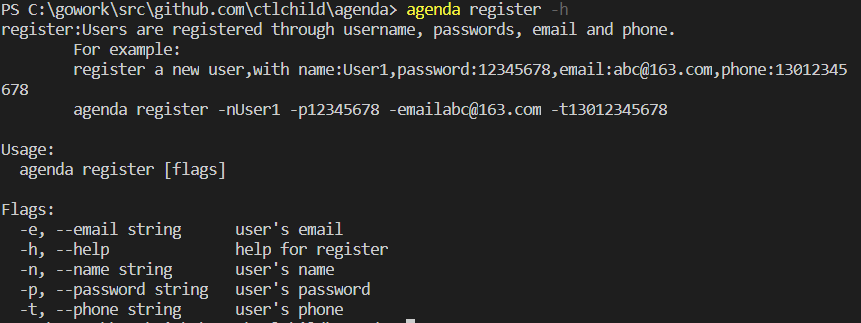

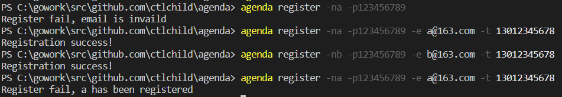

**用户登录**

1. 用户使用用户名和密码登录 Agenda 系统。
2. 用户名和密码同时正确则登录成功并反馈一个成功登录的信息。否则，登录失败并反馈一个失败登录的信息。

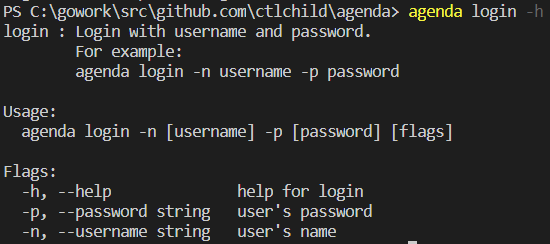

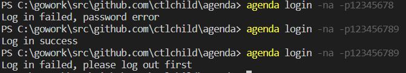

**用户登出**

1. 已登录的用户登出系统后，只能使用用户注册和用户登录功能。

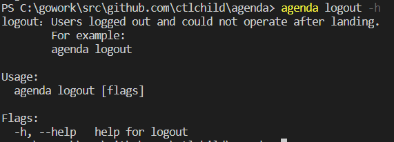

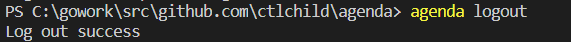

**用户查询**

1. 已登录的用户可以查看已注册的所有用户的用户名、邮箱及电话信息。

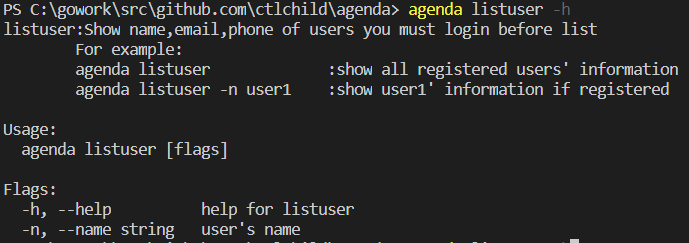

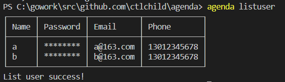

**用户删除**

1. 已登录的用户可以删除本用户账户（即销号）。
2. 操作成功，需反馈一个成功注销的信息；否则，反馈一个失败注销的信息。
3. 删除成功则退出系统登录状态。删除后，该用户账户不再存在。
4. 用户账户删除以后：
   - 以该用户为 发起者 的会议将被删除
   - 以该用户为 参与者 的会议将从 参与者 列表中移除该用户。若因此造成会议 参与者 人数为0，则会议也将被删除。

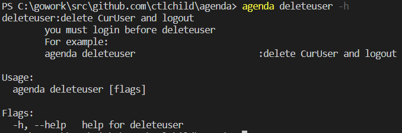

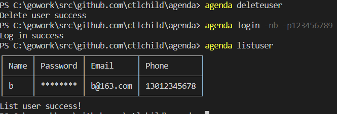

**创建会议**

1. 已登录的用户可以添加一个新会议到其议程安排中。会议可以在多个已注册 用户间举行，不允许包含未注册用户。添加会议时提供的信息应包括：
   - 会议主题(title)（在会议列表中具有唯一性）
   - 会议参与者(participator)
   - 会议起始时间(start time)
   - 会议结束时间(end time)
2. 注意，任何用户都无法分身参加多个会议。如果用户已有的会议安排（作为发起者或参与者）与将要创建的会议在时间上重叠 （允许仅有端点重叠的情况），则无法创建该会议。
3. 用户将获得适当的反馈信息，以便得知是成功地创建了新会议，还是在创建过程中出现了某些错误。

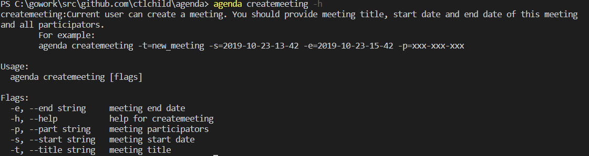

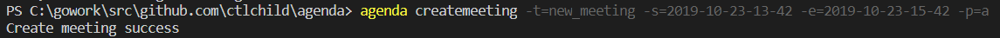

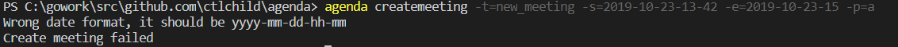

**增删会议参与者**

1. 已登录的用户可以向 自己发起的某一会议增加/删除 参与者 。
2. 增加参与者时需要做 时间重叠 判断（允许仅有端点重叠的情况）。
3. 删除会议参与者后，若因此造成会议 参与者 人数为0，则会议也将被删除。

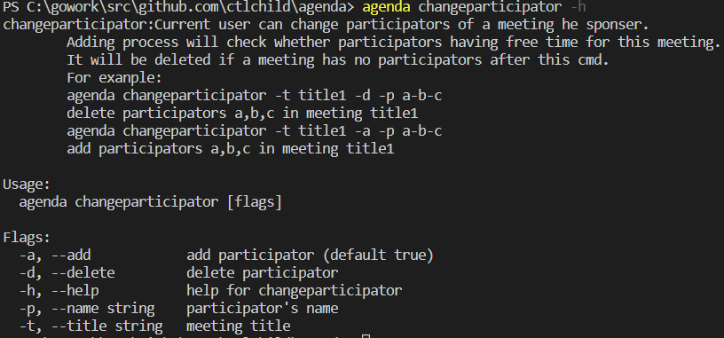

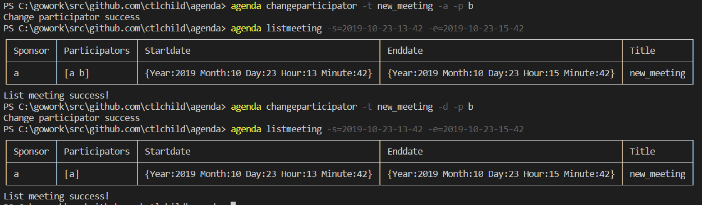

**查询会议**

1. 已登录的用户可以查询自己的议程在某一时间段(time interval)内的所有会议安排。
2. 用户给出所关注时间段的起始时间和终止时间，返回该用户议程中在指定时间范围内找到的所有会议安排的列表。
3. 在列表中给出每一会议的起始时间、终止时间、主题、以及发起者和参与者。
4. 注意，查询会议的结果应包括用户作为 发起者或参与者 的会议。

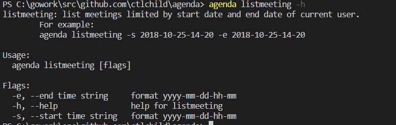


**取消会议**

1. 已登录的用户可以取消 自己发起 的某一会议安排。
2. 取消会议时，需提供唯一标识：会议主题（title）。

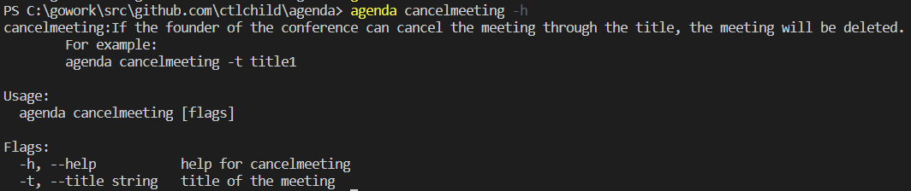

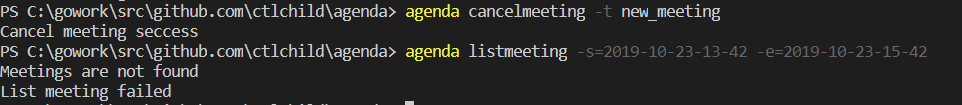

**退出会议**

1. 已登录的用户可以退出 自己参与 的某一会议安排。
2. 退出会议时，需提供一个唯一标识：会议主题（title）。若因此造成会议 参与者 人数为0，则会议也将被删除。

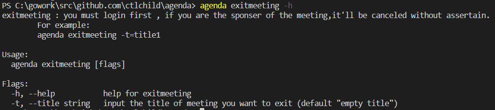

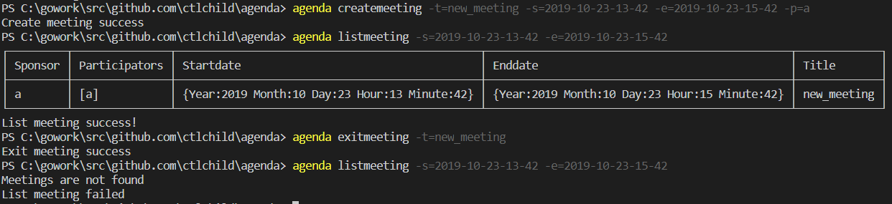

**清空会议**

1. 已登录的用户可以清空 自己发起 的所有会议安排。

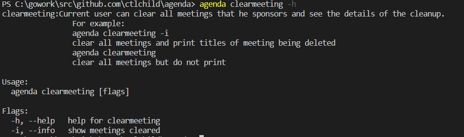

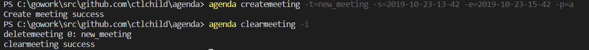

### 目录结构

```
│  LICENSE                    cobra License 
│  agenda.go                  主程序
│  README.md                  README
│  
├─cmd                         命令具体实现
│      cancelmeeting.go       取消会议
│      changeparticipator.go  修改参与人员
│      clearmeeting.go        清除会议
│      createmeeting.go       创建会议
│      deleteuser.go          删除用户
│      exitmeeting.go         退出会议
│      listmeeting.go         查询会议
│      listuser.go            查询用户
│      log.go                 命令访问log文件的接口实现
│      login.go               登录
│      logout.go              登出
│      register.go            用户注册
│      root.go                cobra生成的root文件
│      
├─datarw                      数据存取
│      Agenda.log             log日志
│      CurUser.json           保存当前登录的用户
│      meetingrw.go           会议的Json文件存取接口
│      Meetings.json          会议的Json文件
│      userrw.go              用户的Json文件存取接口
│      Users.json             用户的Json文件
│      
├─entity                      实体
│      Date.go                日期实体
│      EntityFunc.go          实体和命令的接口
│      Meeting.go             会议实体
│      User.go                用户实体
│      
└─image                       测试样例中的图片
```

### 实验过程

用cobra创建预设代码

```
cobra init --pkg-name github.com/ctlchild/agenda
```

用.json实现数据的可持久化，`Meeting.json`,`User.json`分别存放了当前存在的会议和用户，`CurUser.json`保存了当前登录的用户的信息。

`GetMeetings()`与`SaveMeetings`的实现如下

```go
func GetMeetings() []entity.Meeting {
	filePath := "datarw/Meetings.json"
	var Meetings []entity.Meeting
	if existFile(filePath) {
		josnStr, err := ioutil.ReadFile(filePath)
		checkError(err)
		str := strings.Replace(string(josnStr), "\n", "", 1)
		if str == "" {
			return Meetings
		}
		err = json.Unmarshal(josnStr, &Meetings)
		checkError(err)
	}
	return Meetings
}
func SaveMeetings(MeetingsToSave []entity.Meeting) {
	filePath := "datarw/Meetings.json"
	if existFile(filePath) {
		os.Truncate(filePath, 0)
	}
	josnStr, err := json.Marshal(MeetingsToSave)
	checkError(err)
	err = ioutil.WriteFile(filePath, josnStr, os.ModeAppend)
	checkError(err)
	os.Chmod(filePath, 0777)
}
```

对于`User.json`,`CurUser.json`的操作也是大同小异，此处不再赘述

在`entity`中实现了`agenda`的实体和直接操作实体的函数，实现了`Meeting`类，`User`类和`Date`类

```go
type Date struct {
	Year, Month, Day, Hour, Minute int
}
type Meeting struct {
	Sponsor       string
	Participators []string
	Startdate     Date
	Enddate       Date
	Title         string
}
type User struct {
	Name     string
	Password string
	Email    string
	Phone    string
}
```

在`cmd`中完成各功能的实现，下面将以用户注册功能为例进行说明，其他功能的实现请看代码实现。

首先需要定义`cobra.Command`和相应`flag`的定义，通过`Use`，`Short`，`Long`的说明定义了该命令并且给出了命令含义和例子，在函数`init()`中定义了所需要的`flags`，在命令行中输入`agenda register -h`就可以看到这些说明。之后我们只要实现`register()`函数就可以了。

```go
var registerCmd = &cobra.Command{
	Use:   "register",
	Short: "Register a new User",
	Long: `register:Users are registered through username, passwords, email and phone.
	For example:
	register a new user,with name:User1,password:12345678,email:abc@163.com,phone:13012345678
	agenda register -nUser1 -p12345678 -emailabc@163.com -t13012345678
	`,
	Run: func(cmd *cobra.Command, args []string) {
		register(Name, Password, Email, Phone)
	},
}

func init() {
	rootCmd.AddCommand(registerCmd)
	registerCmd.Flags().StringVarP(&Name, "name", "n", "", "user's name")
	registerCmd.Flags().StringVarP(&Password, "password", "p", "", "user's password")
	registerCmd.Flags().StringVarP(&Email, "email", "e", "", "user's email")
	registerCmd.Flags().StringVarP(&Phone, "phone", "t", "", "user's phone")
}
```


在函数`register()`的实现如下：

```go
func register(name string, password string, email string, phone string) {
	logInit() //打开.log文件
	defer logFile.Close() //最后关闭.log文件
	logSave("cmd: register called", "[Info]") 

	if isValidName(name) && isValidPassword(password) && isValidEmail(email) && isValidPhone(phone){ //判断各个参数是否合法
		users := datarw.GetUsers()  //从.json文件中取出当前的所有用户
		if entity.HasUser(name, users) { //判断用户是否已存在
			fmt.Println("Register fail, " + name + " has been registered")
			logSave("The username has been registered", "[Warning]")
			logSave("Register fail", "[Warning]")
			return
		}
		
		newuser := entity.User{Name: name, Password: password, Email: email, Phone: phone} //新建用户
		users = append(users, newuser) 
		datarw.SaveUsers(users) //更新.json
		fmt.Println("Registration success!")
		logSave("Registration success", "[Info]")
		return
	}
	fmt.Println("Register fail!")
	logSave("Register fail", "[Warning]")

}
```

为了使各参数更加真实，我用正则表达式对各参数的合法性进行了判断，以函数`isValidEmail()`为例，需要判断电子邮件名称是否形如`xxx@xxx.xxx`，我用`\\w*@\\w*\\.w*`对输入的email进行正则表达式匹配，代码如下：

```go
func isValidEmail(e string) bool {
	b := []byte(e)
	val, _ := regexp.Match("\\w*@\\w*\\.w*", b)

	if !val {
		logSave("email is invaild", "[Warning]")
	}
	return val
}
```

### 